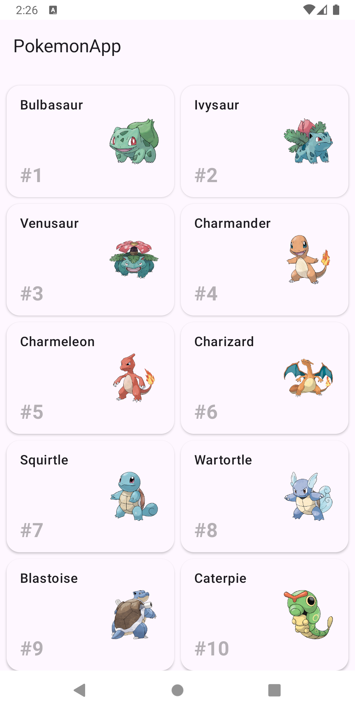

# Pokemon App

This Android application displays a list of Pokemon and their detailed information, built using modern Android development practices with Clean Architecture and Jetpack Compose.

## Technical Architecture

### Clean Architecture Implementation
The app follows Clean Architecture principles with clear separation of concerns across five distinct layers:

- **pokemon-ui**: Jetpack Compose UI components and screens
- **pokemon-presentation**: ViewModels and UI state management
- **pokemon-domain**: Use cases and domain models
- **pokemon-datasource**: Network client and data source
- **pokemon-data**: Repository implementation

## MVVM Pattern Implementation
- View Layer (pokemon-ui): Compose UI components observe ViewModel state and forward user interactions
- ViewModel Layer (pokemon-presentation): Manages UI state with StateFlow, coordinates with domain use cases, and handles lifecycle management
- Model Layer (pokemon-domain + pokemon-data): Domain models and use cases provide clean API to ViewModels through repository pattern

### Key Technical Decisions

**Layer Separation with Mappers**
- Implemented mapping between all layers (API → Data → Domain → Presentation → UI)

**Jetpack Compose for UI**
- Chose Compose for modern, declarative UI development
- Enables easier testing with Compose testing framework

**Repository Pattern**
- Centralized data access through repositories in the datasource layer
- Enables easy switching between different data sources (network, cache, database)

## Features Implemented

### Core Functionality
- **Pokemon List Screen**: Displays a Grid list of Pokemon with basic information (id, name and Image)
- **Pokemon Detail Screen**: Shows height and name details for a selected Pokemon
- **Navigation**: Seamless navigation between list and detail view

### Testing Coverage
- **Unit Tests**: Comprehensive testing for all mapper functions ensuring data integrity across layers
- **UI Tests**: Compose-based testing for both List Screen and Detail Screen user interactions

## What's Missing and Why

**Offline Support**
- No local database implementation (Room)
- Decision: Focused on demonstrating clean architecture and modern UI patterns within time constraints

**No Pagination**
- No lazy loading of pokemon items
- Decision: Focused on demonstrating core list implementation within time constraints

**Design Improvements**
- Improve on the overall design of the app - for Light and Dark theme
- Decision: Focused on displaying core UI within time constraints 

**Other Features**
- No search/filtering functionality
- Decision: Concentrated on solid foundation architecture that would easily support these features

## Additional Notes

**Scalability Considerations**
- The modular architecture supports easy addition of new features
- Each layer can be modified independently without affecting others

**Testing Strategy**
- Focused on testing critical business logic (mappers) and user-facing functionality (UI)
- Compose testing framework provides reliable UI test coverage
- Unit tests ensure data integrity across architectural boundaries

## Screenshots

